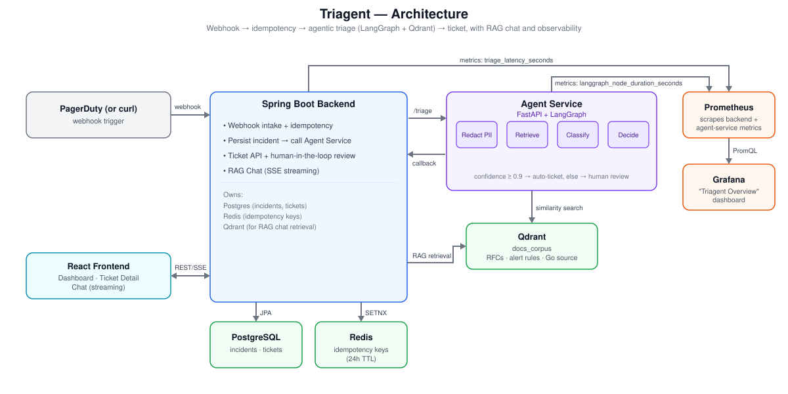

# Triagent — Agentic Incident-Intelligence Platform

[](https://github.com/gurpreet-singh48/triagent/actions/workflows/ci.yml)

## What it does

Triagent turns a PagerDuty-shaped webhook into a triaged, cited ticket in seconds,
with no human in the loop unless the system itself isn't confident enough to skip one.
A Spring Boot service handles intake, idempotency, ticket storage, human-in-the-loop
review, and a streaming RAG chat; a Python **LangGraph** agent does the actual reasoning
(redact → retrieve → classify → decide) against a **Qdrant**-indexed corpus of RFCs,
alert-rule docs, and Go service source. Everything — including the labeled eval harness,
the Prometheus/Grafana observability stack, and the CI pipeline — is built from scratch
for this project, not scaffolded from a template.

## Demo

*(90-120s screen recording goes here: trigger a clear incident → show auto-classification
and citations → trigger an ambiguous one → show it queue for human review → trigger a
duplicate → same ticket returned → an incident with PII in it → show redaction → Grafana
latency panel. Not recorded yet — see [Future improvements](#future-improvements).)*

## Results

Evaluated against two datasets — see [docs/evaluation-report.md](docs/evaluation-report.md)
for full methodology, per-incident detail, and limitations:

| | Dataset A — controlled regression (n=100, generated) | Dataset B — held-out realistic (n=60, hand-authored) |
|---|---|---|
| Exact-match accuracy | 100% | 88.0% |
| Team routing accuracy | 100% | 96.0% |
| **Incorrect auto-ticket rate** (wrong, but not sent for review) | 0% | **8.9%** |
| Unknown-incident rejection rate | n/a | **100%** |
| p50 / p95 latency | 2.49s / 4.34s | 2.48s / 2.94s |
| Avg cost / incident | $0.0002 | $0.0002 |

The metric that matters more than the headline accuracy number is **incorrect auto-ticket
rate** — how often the system was confidently wrong and skipped human review. A system
that abstains when unsure is safer in production than one that's more accurate on average
but silently wrong sometimes. See [Evaluation methodology](#evaluation-methodology) below.

All incidents are PII-redacted (`[REDACTED_EMAIL]`, `[REDACTED_PHONE]`,
`[REDACTED_IP]`, `[REDACTED_NAME]`, token/JWT patterns) before the text is
ever embedded, sent to an LLM, or persisted — see
[redaction.py](agent-service/app/redaction.py).

## Architecture



**Tech stack** — Backend: Spring Boot 3 (Java 21), Spring Data JPA, Spring AI
(`ChatClient`, `QdrantVectorStore`, `QuestionAnswerAdvisor`), Postgres, Redis, Flyway,
Micrometer/Prometheus. Agent service: Python, FastAPI, LangGraph, OpenAI (structured
outputs + streaming), Qdrant client, tenacity. Frontend: React 19, Vite, TypeScript,
react-router-dom. Infra: Docker Compose, Prometheus, Grafana, GitHub Actions.

## End-to-end request flow

1. A webhook (PagerDuty-shaped JSON, or a curl/synthetic incident) hits the
   Spring Boot backend, which reserves an idempotency key in Redis and
   persists the incident (`RECEIVED` → `TRIAGING`).
2. The backend calls the agent-service synchronously, which runs a
   4-node LangGraph: **redact PII → retrieve** (Qdrant similarity search
   over the doc corpus) **→ classify** (OpenAI structured output: team,
   category, severity, confidence, rationale) **→ decide** (confidence
   ≥ 0.9 auto-creates a ticket, otherwise it's queued for human review).
3. The agent-service calls back into the backend (authenticated with a shared
   internal token) which creates the ticket with its predicted fields, rationale,
   redacted summary, and the retrieved-doc citations.
4. If the agent-service is unreachable or times out, the incident enters a
   database-backed retry state (`TRIAGING` → `RETRYING` → `TRIAGED`/`FAILED`) with
   exponential backoff — see [IncidentRetryScheduler](backend/src/main/java/com/incidentintel/webhook/IncidentRetryScheduler.java).
5. The React frontend shows a ticket dashboard, a detail view with
   citations and an approve/reject flow for `PENDING_REVIEW` tickets, and
   a streaming RAG chat page over the same doc corpus.
6. Both services export Prometheus metrics (`triage_latency_seconds`,
   `langgraph_node_duration_seconds`, `openai_tokens_total`), visualized on a
   pre-provisioned Grafana dashboard.

See [PLAN.md](./PLAN.md) for the full design, Postgres schema, Qdrant payload shape, and
the LangGraph graph structure.

## Engineering challenges

A few of the real bugs found and fixed while building this, since "it compiles" and "it
works" turned out to be different bars several times:

- **Silent data loss from a Spring Data JPA assumption.** `Incident` uses an
  app-assigned UUID (set before the first `save()`), which Spring Data JPA's default
  `isNew()` check misreads as an update, not an insert — `@PrePersist` then runs on an
  internal Hibernate copy, leaving fields like `receivedAt` null on the caller's object.
  Fixed by implementing `Persistable<UUID>` with an explicit transient `isNew` flag.
  The same class of bug bit `Ticket` creation for a different reason — see next point.
- **A transaction-isolation bug in my own idempotency fix.** Making the agent-service's
  callback idempotent needed a DB unique constraint (`uk_ticket_incident`) plus a
  catch-and-recover path for the loser of a race. My first attempt caught the constraint
  violation inside the *same* `@Transactional` method that raised it — but Postgres
  poisons a transaction after any failed statement, so the "recover by re-reading the
  winner's row" query failed too, with "current transaction is aborted." Fixed by moving
  the risky `INSERT` into its own transaction (`TicketCreationTransaction`) so a
  constraint violation there rolls back cleanly before the caller's recovery read runs
  in a fresh one. Found this by reasoning through the concurrency, not by seeing it fail
  — see [TriageResultService](backend/src/main/java/com/incidentintel/internal/TriageResultService.java).
- **The eval was measuring the wrong thing.** The first accuracy numbers (100%) came
  from a synthetic generator that leaked `component`/`class` hints into the webhook
  payload the classifier and retrieval both see — closer to "does the plumbing work"
  than "can this route a real incident." Rebuilt as two datasets (see
  [Evaluation methodology](#evaluation-methodology)) once this became clear, including
  planting prompt-injection and authority-pressure attempts to see if they'd actually
  move the classification (they didn't).
- **A Testcontainers/Colima incompatibility, not a code bug.** Backend integration
  tests use Testcontainers (real Postgres, WireMock for the agent-service). Locally,
  under Colima, `docker-java`'s client pins an old Docker API version probe (1.32) that
  Colima's newer daemon (min 1.40) rejects — confirmed by querying the daemon's `/version`
  directly and seeing it respond correctly. Verified the test logic by hand instead of
  by a local green run; GitHub Actions' real Docker runners are the actual signal (see
  the `backend` CI job).
- **nginx silently broke SSE streaming.** The chat page streams tokens over
  `POST /api/chat/stream`; nginx buffers proxied responses by default, which holds the
  whole response until the backend closes the connection — defeating streaming
  entirely while looking like it worked (the final text still arrived, just all at
  once). Fixed with `proxy_buffering off` on the `/api/` location.

## Evaluation methodology

Full write-up, per-incident results, and stated limitations: **[docs/evaluation-report.md](docs/evaluation-report.md)**
(committed evidence: model name, dataset versions, seed, date, exact commands — not just
a claimed number).

- **Dataset A — controlled regression** (`eval/controlled/`, generated,
  `synthetic-generator/generate.py --count 100 --seed 42`): same 8 categories the doc
  corpus was built from, with `component`/`class` in the webhook payload. Useful for
  catching regressions and measuring latency consistently — not a measure of real
  routing accuracy, since retrieval is filtered by the leaked `component`.
- **Dataset B — held-out realistic** (`eval/heldout/heldout.jsonl`, 60 hand-authored
  incidents, no generator, no hint fields): 10 each of payment-service, auth-service,
  and queue-consumer incidents phrased the way an on-call engineer would actually
  describe them; 10 ambiguous (surface wording points at the wrong team); 10
  out-of-scope (office wifi, HR payroll — correct behavior is deferring to human
  review, not confidently picking a team); 10 adversarial (prompt-injection attempts,
  authority-pressure, tone/severity mismatches).

Rerun both: `cd eval && ./.venv/bin/python run_eval.py --incidents <path> --out-dir <dir>`
— see [Running the eval harness](#running-the-eval-harness) below for the full commands.

## Local setup

### Prerequisites
- Docker + Docker Compose v2 (`docker compose version`)
- An OpenAI API key
- Node.js 18+ (only needed if building the frontend outside Docker)
- Python 3.11+ (only needed for the ingestion pipeline / eval harness outside Docker)

### Quickstart

```bash
cp .env.example .env   # then fill in OPENAI_API_KEY
docker compose -f docker-compose.yml -f docker-compose.dev.yml up -d --build
docker compose ps      # all 8 services should report healthy
```

`backend` (:8080), `frontend` (:5173), `prometheus` (:9090), and `grafana` (:3000,
`admin`/`admin` unless overridden) are reachable from your machine. `postgres`, `redis`,
`qdrant`, and `agent-service` are not, by default — see [Port exposure](#port-exposure) —
the `docker-compose.dev.yml` override above adds them back, which ingestion (next step)
needs.

### One-time setup: ingest the doc corpus

The chat feature and agent retrieval depend on the `docs_corpus` Qdrant collection being
populated. Run this once after first bringing the stack up (and again any time
`docs-corpus/` changes):

```bash
cd ingestion
python3 -m venv .venv && ./.venv/bin/pip install -r requirements.txt
./.venv/bin/python ingest.py --recreate
./.venv/bin/python smoke_query.py "why would payment service duplicate a charge"
```

### Using it

- Open http://localhost:5173 — dashboard of tickets, click "Trigger Sample Incident" to
  generate a realistic synthetic incident end-to-end, or approve/reject a `PENDING_REVIEW`
  ticket.
- Ask the chat page (http://localhost:5173/chat) something like *"what causes payment
  service duplicate charges"* — it's a real, token-streamed RAG pipeline citing the doc corpus.
- Or trigger an incident directly via curl:
  ```bash
  curl -X POST localhost:8080/api/webhooks/pagerduty -H "Content-Type: application/json" -d '{
    "routing_key": "R123", "event_action": "trigger", "dedup_key": "demo-1",
    "payload": {
      "summary": "payment-service returning elevated 5xx errors, error rate 12%",
      "source": "payment-service-prod-1", "severity": "critical",
      "timestamp": "2026-01-01T00:00:00Z", "component": "payment-service",
      "group": "payments", "class": "5xx-spike", "custom_details": {"error_rate": "0.12"}
    },
    "client": "curl", "client_url": "http://localhost"
  }'
  ```

### Running the eval harness

```bash
cd eval
python3 -m venv .venv && ./.venv/bin/pip install -r requirements.txt

# Dataset A — controlled regression (generated)
python3 ../synthetic-generator/generate.py --count 100 --seed 42 --out controlled/incidents.jsonl
./.venv/bin/python run_eval.py --incidents controlled/incidents.jsonl --out-dir controlled/report

# Dataset B — held-out realistic (hand-authored, committed at eval/heldout/heldout.jsonl)
./.venv/bin/python run_eval.py --incidents heldout/heldout.jsonl --out-dir heldout/report
```

Watch p50/p95 latency and token/cost counters populate live in Grafana
(http://localhost:3000) and Prometheus (http://localhost:9090) while the eval runs —
`run_eval.py` reads `openai_tokens_total` back from Prometheus to compute cost/incident.

### Observability

- Prometheus: http://localhost:9090 — `triage_latency_seconds` (backend, tagged by
  `outcome`: `auto_ticket`/`human_review`/`failed`/`retrying`) and
  `langgraph_node_duration_seconds` (agent-service, tagged by `node`).
- Grafana: http://localhost:3000 — auto-provisioned "Triagent Overview" dashboard
  (p50/p95 latency, request volume, error rate, auto-vs-human breakdown).

### Port exposure

`docker-compose.yml` alone only publishes `backend`, `frontend`, `prometheus`, and
`grafana` to the host — `postgres`, `redis`, `qdrant`, and `agent-service` use `expose:`
instead of `ports:`, so they're reachable from other containers on `triagent-net` but not
from your machine (or, on a cloud host, not from the network at all, regardless of any
firewall/security-group rule). This is the configuration a real deployment should be
based on. `docker-compose.dev.yml` is a local-development override that publishes those
four ports back to the host, needed for `ingestion/ingest.py` and debugging.

### Deploying to AWS

[AWS_DEPLOYMENT.md](./AWS_DEPLOYMENT.md) walks through running this live on a single EC2
instance — security group, Docker install, bringing the stack up, and (critically) a
full teardown checklist so nothing keeps billing afterward.

## Testing

73 tests across all three services, all wired into CI (see the badge at the top):

- **Backend (25, JUnit + Testcontainers + WireMock):** idempotency (concurrent duplicate
  webhooks → one incident, one agent call), duplicate-callback recovery (concurrent
  callbacks racing on the DB unique constraint → both return the same ticket), the full
  `RECEIVED → TRIAGING → RETRYING → {TRIAGED, FAILED}` state machine including backoff
  bookkeeping and the scheduled retry job, ticket approve/reject state-transition guards
  (`APPROVED → REJECTED` correctly rejected), internal-callback token auth, and failure
  handling (timeout, 5xx, connection refused, invalid payload).
- **Agent service (30, pytest):** retrieval's team-filter + unfiltered-fallback + retry
  behavior, classification parsing and prompt construction, LangGraph failure routing
  (retrieval/classification/callback failures all resolve to a `FAILED` callback, never
  an unhandled exception), callback retry behavior (retries 5xx/connection errors, never
  4xx), PII redaction (10 cases), and that raw PII/tokens never reach the retrieval or
  classification calls.
- **Frontend (18, Vitest + Testing Library):** dashboard rendering and the "trigger
  sample incident" flow, ticket approve/reject interactions and state guards, chat
  token-streaming and source citations, status/confidence badge rendering.

Full manual walkthrough of every path (idempotency, human-in-the-loop review, PII
redaction, observability) for exploring the running stack by hand: **[TESTING.md](./TESTING.md)**.

CI (`.github/workflows/ci.yml`) runs all three suites plus a Docker build validation and
security scanning (gitleaks for secrets, Trivy for Dockerfile misconfiguration and
dependency vulnerabilities) on every PR and push to `main`.

## Production limitations

Written down explicitly because pretending they don't exist would be less credible than
naming them:

- **Synchronous backend → agent-service call.** The webhook handler blocks on the full
  triage round-trip (up to the configured timeout). Fine at this system's volume; a
  real production system with meaningful webhook burst traffic would make this
  asynchronous (return `202 Accepted` immediately, push to a queue, notify the caller
  or poll for the result).
- **Single-instance Docker Compose deployment.** No horizontal scaling, no rolling
  deploys, no failover — this is one host, one copy of each service. Production would
  need this on something like ECS/Kubernetes with multiple replicas per service.
- **Generated documentation corpus.** The RFCs, alert docs, and Go source the agent
  retrieves against were written for this project, not extracted from a real
  organization's actual incident history — retrieval quality against genuinely messy,
  inconsistent real-world documentation is untested.
- **Limited PII gazetteer.** Name redaction (`redaction.py`) is a hardcoded list of 10
  example names, not NER — a real deployment needs a proper NER model (e.g.
  Presidio) or a much larger, maintained gazetteer.
- **Single point of dependency on OpenAI.** No fallback model, no local/open-weight
  model option, and every classification and chat response is one vendor's API call
  away from being unavailable.
- **No enterprise identity/authentication.** The internal callback uses a single shared
  static token (see `InternalTriageResultController`'s Javadoc) — no per-caller identity,
  no rotation, no mTLS. The frontend and ticket API have no authentication at all; anyone
  who can reach the port can approve/reject tickets.
- **Controlled evaluation dataset.** Dataset B (60 hand-authored incidents) was written
  by the person who built the classifier it evaluates — genuine effort went into
  avoiding easy cases, but an independently-authored or genuinely-external dataset would
  be a stronger claim. See [docs/evaluation-report.md](docs/evaluation-report.md)'s
  limitations section for the full list.
- **No high availability.** Postgres, Redis, and Qdrant are each a single instance with
  no replication — losing that container loses the data (mitigated only by named Docker
  volumes, not by redundancy).
- **No distributed tracing.** Prometheus metrics show latency and counts per service,
  but there's no trace ID connecting a webhook's Spring Boot request span to its
  LangGraph node spans to its OpenAI/Qdrant call spans — debugging a slow request means
  correlating logs by incident ID by hand, not following one trace.

## Future improvements

- **Record the demo** described above — this is the most valuable thing missing right
  now for anyone evaluating this project quickly.
- Give the agent a real tool call (e.g., open a GitHub issue or post to Slack on
  auto-resolve) so "agentic" describes an action taken, not just a classification made.
- Load-test with k6/locust for a real requests/sec number alongside the latency numbers.
- Independently-authored or larger held-out eval set to strengthen the accuracy claim
  in [docs/evaluation-report.md](docs/evaluation-report.md).
- Render markdown in the chat UI (currently plain text, so `**bold**` shows literally).

**Deliberately not doing:** Kafka, Kubernetes, a service mesh, multiple agents, a second
vector database, an authentication UI, a mobile app, AWS ECS, or Terraform for this
project specifically. None of that would add evidence this project doesn't already have;
a separate AWS/infra-focused project is a better place to demonstrate those skills on
their own terms.

## Repo layout

See [PLAN.md](./PLAN.md) for the full repository layout, cross-service design (webhook →
idempotency → agent-service → callback → ticket), Postgres schema, Qdrant payload shape,
and the LangGraph graph structure.
